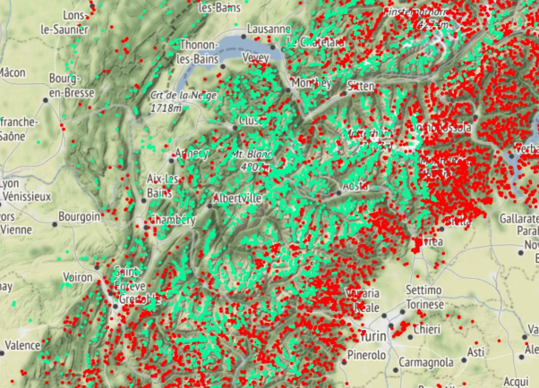
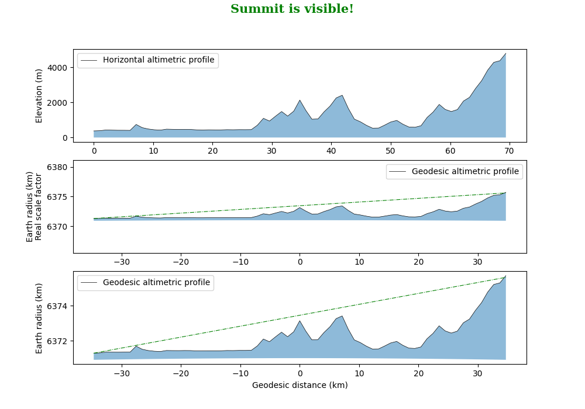
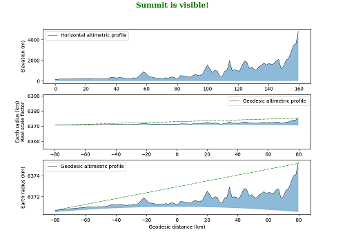
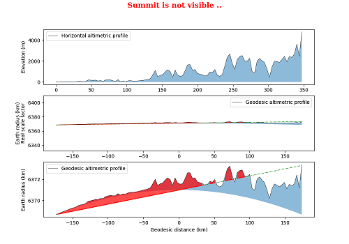
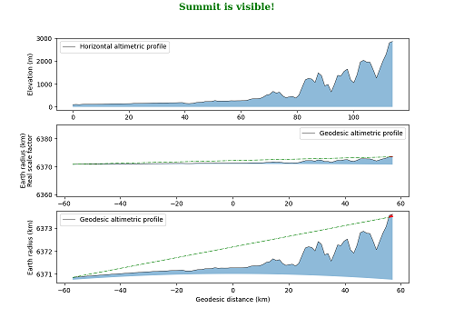
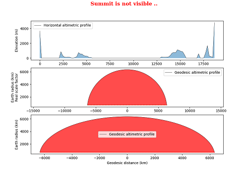
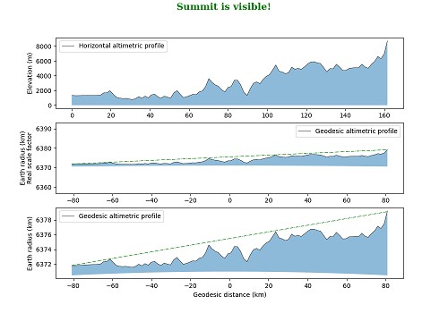

# Summit-in-Sight

Python package to determine the visibility of a summit from specified locations. It allows to generate a map with the locations from which a summit is in sight.

## See the results: Where is Mont-Blanc (4810 m) visible?
**Global results:** (click on image)

[](https://htmlpreview.github.io/?https://raw.githubusercontent.com/SamDurand/Summit-in-Sight/main/data/maps/from_summits_MontBlanc.html?token=GHSAT0AAAAAAB6GVP5XZJTZP7DTNTQKSZZ2Y76DMQQ)

**Only from summits:** (click on image)

[](https://htmlpreview.github.io/?https://raw.githubusercontent.com/SamDurand/Summit-in-Sight/main/data/maps/from_summits_MontBlanc.html?token=GHSAT0AAAAAAB6GVP5XZJTZP7DTNTQKSZZ2Y76DMQQ)

## Installation

1. Zip download the repository or clone it to your local machine using:
```
git clone https://github.com/SamDurand/Summit-in-Sight.git
```
2. Open the terminal or command prompt and navigate to the directory containing the requirements.txt file.

3. Run the command:
```
pip install -r requirements.txt
```
4. The packages will be installed in your Python environment, and you can verify this by running `pip freeze` to see all of the installed packages and their versions.

## Basic usage

### 1) Determine if a summit is in sight from a location

**A full example is provided in `plot_view_possible.py`.**

Use the `summit_is_visible_online` function to check if a summit is visible from a given location. For example, you can use it to check if Mont Blanc is visible from Geneva, Switzerland. 

To do so, you need to provide the decimal coordinates of your location (`location_point`) and the coordinates of the summit (`location_summit`). You can also specify an offset for your location (`offset_view`) and for the summit (`offset_summit`). The function will then return a boolean value (True or False) indicating if the summit is visible from your location. Additionally, it will plot a map with the visibility line between your location and the summit.

```python
from summit_lib import summit_is_visible_online

location_point =  [46.206939 , 6.147794] # Your location
location_summit = [45.832542 , 6.864717] # The summit to spot
offset_view = 2
offset_summit = -100

view_possible, data = summit_is_visible_online(location_point, location_summit, plot=True, offset_view=offset_view,offset_summit=offset_summit)
```

Return:
```python
Location point: Pont du Mont-Blanc, Rue du Mont-Blanc, Grottes et Saint-Gervais, Genève, 1201, Schweiz/Suisse/Svizzera/Svizra
Location summit: Les Bosses, Chamonix-Mont-Blanc, Bonneville, Haute-Savoie, Auvergne-Rhône-Alpes, France métropolitaine, 74400, France

Summit in sight! Distance =  69.54 km
```



The first plot shows the horizontal altimetric profile between your location and the summit.

The second and third plot shows the geodesic profile between your locations. These profiles are used to compute if a summit is in sight. 

The dashed green line represents the line of sight. If the line of sight intersects the relief, the view is therefore impossible and the summits intersected are filled with red.

Some additional examples below:
1. Mont Blanc (4810m, Alps) from Lyon Fourvière (France):



2. Mont Blanc (4810m, Alps) from Montpellier (France):



3. Mont Rosa (4634m, Alps) from Milan (Italy):



4. Mont Blanc (4810m, Alps) from Mont Cook (3724m, New Zealand):



5. Everest (8848m) from Katmandu (Nepal)
   


### 2) Generate a map of possible views of a summit

**A full example is provided in `multi_locations_offline.py`.**

The `generate_locations_grid` function is used to generate the grid of locations, and `summit_is_visible_multi_locations_offline` is used to determine the visibility of a summit from each position.

To generate the grid, you must first define the limits of your bounding box, defined by its `top_left_corner` position, `bottom_right_corner` position and resolution (`res`) in kilometers.

You can also specify an offset for your location (`offset_view`) and for the summit (`offset_summit`).

The results are saved in a csv file containing the coordinates of each location and `view_possible`, the boolean value (True or False) indicating whether the summit is visible from that location.

You can then use the `plot_view_possible` to plot your coordinates on a map.


*Profile image was generated using AI: [DALL E](https://openai.com/dall-e-2/)*
